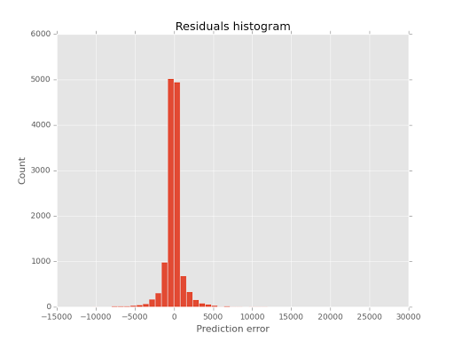
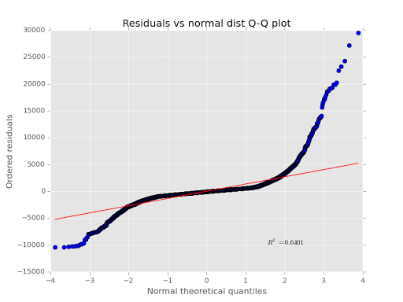
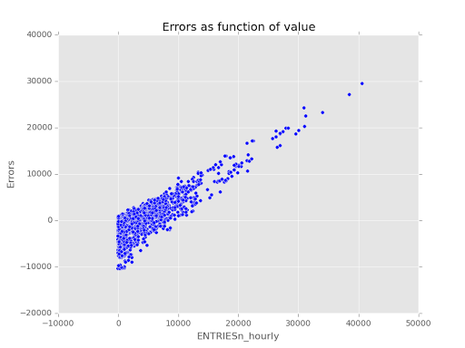
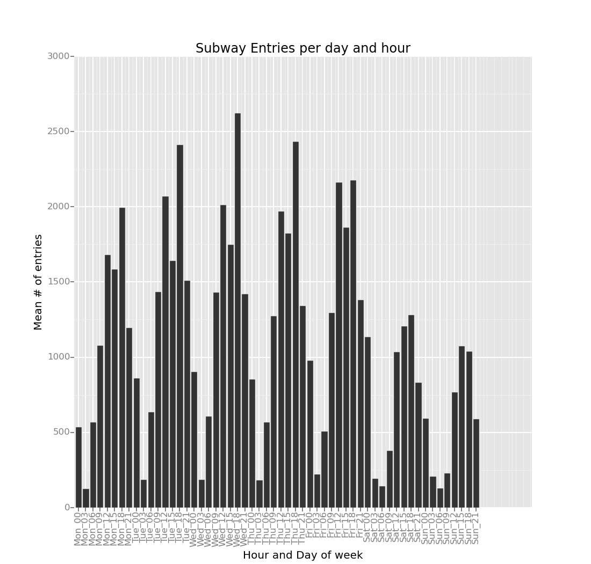

# Analyzing the NYC Subway Dataset

github: https://github.com/tollek/udacity-data-science/tree/master/p1

## Section 1. Statistical Test

1.1 Which statistical test did you use to analyze the NYC subway data? Did you use a one-tail or a two-tail P value? What is the null hypothesis? What is your p-critical value?

> To choose a suitable statistical test, I want to find out first how does the population distribution look like.
  Can I use any test deisnged to work with normal distribution or should I use nonparameteric test?
  Histogram below shows that the sample distribution for subway data is not normal, it is positively skewed.

> 

> We could verify that sample is not normally distributed with Shapiro–Wilk.
  For non-normal distribution I chose Mann–Whitney U test:

>     H0: Ridership samples for rainy and non-rainy days come from the same population
>     HA: Rideship samples for rainy and non-rainy days come from different population
>         and one of the samples have larger values than the other.
>     P value: two-tailed
>     p-critical value: 0.05

1.2 Why is this statistical test applicable to the dataset? In particular, consider the assumptions that the test is making about the distribution of ridership in the two samples.

> Mann-Whitney U is a nonparametric test and can be applied to unknown distributions.

1.3 What results did you get from this statistical test? These should include the following numerical values:
    p-values, as well as the means for each of the two samples under test.

>     # of non-rainy days samples: 87847
>     # of rainy days samples: 44104

>     mean(norain): 1090.278780151855
>     mean(rain): 1105.4463767458733

>     U: 1924409167.0    (which is ~99.3% of max U = 1937202044)
>     one-tailed p-value: 0.25 (.024999912793489721)
>     two-tailed p-value: 0.5  (.049999825586979442)

1.4 What is the significance and interpretation of these results?

> Sample's means ratio = 0.986, which is insufficient to draw any conclusions.
> Test statistic U is close to the maximal value, which would indicates that H0 is true.

> Hovewer, the p-value of the test (0.05 after rounding) is below the critical p-value, and rejects the null hypothesis.
> As a result, we can say with 95% confidence that subway ridership differ on rainy and non-rainy days.

## Section 2. Linear Regression

2.1 What approach did you use to compute the coefficients theta and produce prediction for ENTRIESn_hourly in your regression model:

> OLS using Statsmodels

2.2 What features (input variables) did you use in your model? Did you use any dummy variables as part of your features?

> Weather features:
>    - rain
>
> I tried using each of weather features, but none of them appeared to increase the R^2 value significantly.
> Rain has been kept to test the hypothesis about the change in ridership.
>
> Dummy features:
>   - UNIT (most siginificant impact on R^2 among all variables)
>   - hour (hour effect on R^2 improved from 0.490 to 0.533 if used as categorical rather than numeric variable)
>   - day of week (R^2 increase from 0.520 to 0.533)

2.3 Why did you select these features in your model? We are looking for specific reasons that lead you to believe that the selected features will contribute to the predictive power of your model.

> **Weather features**:
> Iniitially I tried to use all weather features available, but the impact on the R^2 was minimal.
>   With all weather features 'enabled' I always ended with rain coefficient < 0, which contradicted
>    the initial idea that rain increases the subway usage.
>
> All weather features:
>
>      intercept:      -8747.24028031
>      maxpressurei     3620.94110663
>      maxdewpti          25.732115055
>      mindewpti         -11.3216759107
>      minpressurei      912.491651196
>      meandewpti        -17.1433407762
>      meanpressurei   -4147.26819723
>      fog               153.6983015
>      * rain            -51.0401670367
>      meanwindspdi        5.40945704219
>      mintempi          -61.3734500215
>      meantempi         161.157745292
>      maxtempi          -96.3488986927
>      precipi           -52.5742419163
>      * r_squared         0.535606552964
>
> With other weather features removed, I finally got a model with rain > 0.
>
>      intercept:       1182.06210326
>      rain               19.0895076769
>      r_squared           0.533107241184
>
> However changing the input sample (local machine test) invalidated the hypothesis about
> significant positive impact of rain to ridership.
>
>      intercept:         -2.21704712523e+14
>      rain              -48.6854208837
>      r_squared           0.509334614477
>
> **Categorical features**:
>  - *UNIT*: as mentioned before, unit has the most siginificant impact on the R^2. Reason behind it is rather
>    obvious: different station (and different turnstiles units in those stations) have different 'base' ridership
>    which depends on location, distance to offices, schools, malls, etc.
>    As a string variable UNIT could not be used with single coefficient.
>  - *hour*: transforming hour to a categorical variable enables discovering by the model some non-trivial
>    effects that the variable has. For *hour* variable such effects are:
>    - being cyclical: distance from 23 to 0 is the same as 0 to 1.
>    - multiple peaks (during rush hours)
>  - *day_of_week*:
>    - days of week are cyclical;

2.4 What are the parameters (also known as "coefficients" or "weights") of the non-dummy features in your linear regression model?

>     intercept:       1182.06210326
>     rain               19.0895076769

2.5 What is your model’s R2 (coefficients of determination) value?

>     r_squared           0.533107241184

2.6 What does this R2 value mean for the goodness of fit for your regression model? Do you think this linear model to predict ridership is appropriate for this dataset, given this R2  value?

> The single R^2 value of ~0.533 is not enough to clearly answer the question if the linear model is a good choice for
> NYC subway ridership dataset. For given R^2 we can have a few different explanations:
> - the model type is a bad choice, e.g. data has some significant nonlinearity that cannot be ignored
> - the dataset itself has large variances, event between samples which seem 'similar' to each other.
>   Indeed, the ridership data has large variances, even if we group the data by the UNIT (which has the biggest impact on the
>    ENTRIESn_hourly value).
>    Below we have a sample of 5 random UNITS with mean and stdev’s of each UNIT:
>
>           UNIT  rain     sum         mean          std  std / mean
>       0   R002     0  118434   978.793388  1297.572978    1.325686
>       1   R002     1   58101   937.112903  1282.306722    1.368359
>       2   R027     0  376892  2921.643411  4413.031651    1.510462
>       3   R027     1  204139  3046.850746  4773.857062    1.566817
>       4   R028     0  336519  2530.218045  2916.048297    1.152489
>       5   R028     1  172388  2462.685714  2994.253049    1.215849
>       6   R045     0  331189  2670.879032  2985.021618    1.117618
>       7   R045     1  217318  3505.129032  3559.578233    1.015534
>       8   R061     0   72316   663.449541   502.890782    0.757994
>       9   R061     1   39480   692.631579   542.232476    0.782858
>
>   For most of data the stdev is larger or close to the mean, which means that the ridership data has
>   large variance. Even if we fix most of the parameters (like unit, day of week, rain),
>   we have large spread of ridership values.
> - combination of both explanations above
>
> To answer the question more precisely, we should analyze the model residuals.
>
> 
>
> For good working model, residuals should form a normal distribution. Plot above shows strong central part and two long
> tails, with right tail range twice bigger than left one. The distribution does not look like normal distribution and
> indicates some problem with the model, especially on the tails.
> For more details, we can use Q-Q plot.
>
> 
>
> Clearly, the values on tails do not follow normal distribution, and the difference grows rapidly after exceeding:
>
>     z = -2 [p = 0.228, sample value = 0]
>     z = 2  [p = 0,977, sample value ~5000]
>
> It most likley means that the model overestimated values for samples with *ENTRIESn_hourly* = 0 and
> underestimated large values of *ENTRIESn_hourly* (it's possible that large negative errors come from samples that
> are far from 0, but this is the most reasonable explanation).
>
> Finally, to see where the biggest errors come from, we plot residuals (errors) as function of values:
>
> 
>
> As expected after the Q-Q plot, the 0 values have large error due to overestimation and large values (> 10000)
> have large error due to model underestimation. It seems, that the dataset has 3 significantly different segments of samples:
>
> - [0, 0]
> - (0, 5000]
> - (5000, inf)
>
> and that simple linear model cannot reliably predict values of the whole dataset.
>
> To check the hypothesis about the 3 segments, I retrained a model on samples with ENTRIESn_hourly from interval [50-5000].
> Residual graphs for this segments:
>
> 
>
> Graphs show much 'healthier' residuals distributions:
> - histogram looks more like normal distribution,
> - Q-Q plot shows that distribution follows the normal distribution more closely (althouth there are still differences on tails)
> - errors spread almost uniformly throughout all the values.
>
> The subset model is still far from perfection, but does not suffer from nonlinear effects as strongly as the model trained
> on the whole dataset.
>
> Going back to the original question about the the R^2: given 2 siginificant problems with the dataset (large variance and
> nonlinearity) we can say that linear model in its basic version is not appropriate for the NYC subway ridership data.

## Visualization

3.1. Include and describe a visualization containing two histograms: one of ENTRIESn_hourly for rainy days and one of ENTRIESn_hourly for non-rainy days.

> 
>
> For clarity, outliers (ENTRIESn_hourly > 5000, ~4.6% of samples) have been removed from the histogram.
> Distribution of ridership on both rainy and non-rainy days is positively skewed.
> Due to different # of samples for rainy and non-rainy days, we should not try to compare
> the distributions - smaller bar sizes for rainy days are due to smalle number of samples, not because
> of smaller usage of subway on rainy days.

3.2. One visualization can be more freeform. You should feel free to implement something that we discussed in class (e.g., scatter plots, line plots)
or attempt to implement something more advanced if you'd like.

> 
>
> The plot shows the mean number of entires per hour on every day of week. Data is *not* split by rainy/non-rainy days.
> Key insignts:
> - ridership during Mon-Fri is visibly higher than during weekend
> - Mon-Fri have two clear spikes (morning and afternoon rush hours). Weekends don't have such visible
>   difference between morning, afternoon and rest of the day; although there is a difference, it's not as large
>   as during the weekdays
> - even throughout the weekdays, there are small differences in ridership: Wednesday are the most busy days
>   and Mondays are the least busy ones.

## Conclusion

4.1 From your analysis and interpretation of the data, do more people ride
the NYC subway when it is raining or when it is not raining?

> The ridership on rainy days is bigger than on non-rainy ones. Although the difference is rather
> subtle and due to large variability of data, even for particular stations and days of week, it is
> hard to quantitate the effect of weather.

4.2 What analyses lead you to this conclusion? You should use results from both your statistical
tests and your linear regression to support your analysis.

> Mann-Whitney test result, especially the p-value < 0.05 is a proof of significant difference between
> the rainy and non-rainy days ridership.
>
> On the other hand we have signals that the difference is subtle:
>  - Mann-Whitney U statistic is close to maximal value, which indicates similarity between samples
>  - linear regression coefficient for rain is small and varies in sign if we choose different subsample

## Reflection

5.1. Please discuss potential shortcomings of the methods of your analysis, including:
1. Dataset,
2. Analysis, such as the linear regression model or statistical test.

> The dataset contained samples which differ significantly in terms of ridership. The most significant
> factor was the turnstile unit, but even with fixed turnstile we still find large variability for most
> of the samples. Either dataset did not contain enough features to explain the variability, or
> I didn't extract enough information from existing features to explain it.
>
> Mann-Whitney U test showed significant difference between the rainy and non-rainy days, although the
> value of U statistic (close to maximal U value) and P value that was close to the p-critical leaves some
> feeling of insufficiency. The biggest problem I find with the test is the fact, that test is a 'black box'.
> Test results does not give any insight what to do with the data (e.g. how to split it by feature/features)
> to obrain results that leave no doubts about different distribution of populations.
>
> The analysis in 2.6 shows that linear model cannot be used reliably in its current version due to large variablity of data
> and some nonlinearities. Possible improvements:
>  - more features, e.g. relationship between stations or alternative types of transportation
>    might explain more variability in the data
>  - extracting more non-trivial features.
>    'day of week' showed significant improvement on R^2, so including other features might improve it even further
>  - mixed features e.g. (unit + rain). There is a chance that the weather had different impact
>    on stations/days/hours etc. Such effects can be found only if we build 2, 3- basic features mixes.
>  - R^2 is not the perfect measure of the regression model. We could add additional metrics
>    and cross-validate the model.

5.2 (Optional) Do you have any other insight about the dataset that you would like to share with us?

>   None

## References
- [Mann-Whitney U test](https://en.wikipedia.org/wiki/Mann%E2%80%93Whitney_U_test)
- [graphpad.com: Interpreting results: Mann-Whitney test](http://www.graphpad.com/guides/prism/6/statistics/index.htm?
how_the_mann-whitney_test_works.htm)
- [udacity forum: impact of new features and problem with constant variable](https://discussions.udacity.com/t/relationship-between-p-and-r-2-value/19628/2)
- [blog.minitab.com: interpretation of R^2](http://blog.minitab.com/blog/adventures-in-statistics/regression-analysis-how-do-i-interpret-r-squared-and-assess-the-goodness-of-fit)
- [blog.minitab.com: interpreting models with low R^2 values](http://blog.minitab.com/blog/adventures-in-statistics/how-to-interpret-a-regression-model-with-low-r-squared-and-low-p-values)
- [interpration of residuals](http://www.itl.nist.gov/div898/handbook/pri/section2/pri24.htm)

